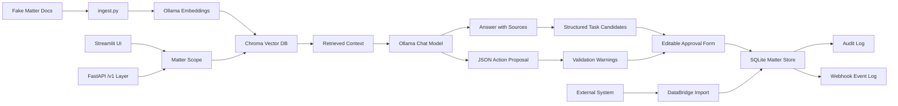

# Mini LOIS: CaseOps AI

Mini LOIS is a small local prototype of an agentic legal operations assistant. It demonstrates the product concepts behind an AI assistant that can read matter files, answer with citations, propose workflow actions, let a user edit/approve those actions, write approved actions back to a mock matter system, and keep an audit trail.

This is a portfolio project, not legal software and not legal advice. It is not affiliated with Filevine.

## Current version

v0.7 adds API Platform hardening: `/v1` routes, idempotency for approval write-backs, pagination/filtering, a fake DataBridge import endpoint, and an API contract document.

## Screenshots

The demo flow is documented in [`docs/screenshots`](docs/screenshots/README.md).


## What it demonstrates

- Matter-scoped retrieval so the assistant only searches inside the selected matter.
- Local RAG using Ollama embeddings and Chroma.
- Source-cited answers based on fake matter documents.
- Structured task candidates returned by the API.
- Structured action proposals for tasks, notes, and calendar events.
- Editable action approval before write-back.
- Validation warnings for risky operational fields such as unsupported due dates or non-matter assignees.
- SQLite-backed mock matter record.
- Audit log of executed AI-assisted actions, including human-edited approvals.
- Webhook-style event records for approved write-backs, such as `task.created`.
- FastAPI endpoints that expose the assistant as tool-style operations.
- Fake API-key authentication for local API testing.
- Structured API errors for auth, validation, missing resources, idempotency conflicts, and unsupported actions.
- Versioned `/v1` API routes.
- Idempotency protection for approval write-backs.
- Pagination and filtering for tasks, audit records, and webhook events.
- Fake DataBridge-style matter import with external ID mapping.
- PM documentation for product specs, backlog, acceptance criteria, beta feedback, launch readiness, and API contracts.

## API and PM artifacts

- [`docs/API_EXAMPLES.md`](docs/API_EXAMPLES.md) — v0.7 curl examples for auth, structured errors, ask, approve, idempotency, audit, webhook events, pagination, and DataBridge import.
- [`docs/API_CONTRACT.md`](docs/API_CONTRACT.md) — stable API shapes for errors, matters, task candidates, approved actions, webhook events, pagination, and DataBridge import.
- [`docs/api.md`](docs/api.md) — API usage, endpoint examples, and structured task candidate response.
- [`docs/product-spec.md`](docs/product-spec.md) — product spec for the AI-assisted matter action workflow.
- [`docs/backlog.md`](docs/backlog.md) — Jira-style backlog issues with acceptance criteria.
- [`docs/beta-feedback.md`](docs/beta-feedback.md) — mock beta feedback synthesis and prioritization.
- [`docs/acceptance-tests.md`](docs/acceptance-tests.md) — manual acceptance test cases.
- [`docs/tool-contract.md`](docs/tool-contract.md) — API/tool contract and MCP-style framing.
- [`docs/launch-checklist.md`](docs/launch-checklist.md) — cross-functional launch readiness checklist.
- [`docs/examples/task-created-webhook.json`](docs/examples/task-created-webhook.json) — mock DataBridge-style webhook payload.

## Architecture



## Tech stack

- Python
- Streamlit
- FastAPI
- Ollama
- ChromaDB
- SQLite

## Setup

Install Ollama first, then pull one chat model and one embedding model.

```bash
ollama pull llama3.2
ollama pull nomic-embed-text
```

Create and activate a virtual environment.

```bash
python3 -m venv .venv
source .venv/bin/activate
pip install -r requirements.txt
```

On Windows PowerShell:

```powershell
python -m venv .venv
.\.venv\Scripts\Activate.ps1
pip install -r requirements.txt
```

Ingest the fake matter documents into Chroma.

```bash
python3 ingest.py
```

Run the Streamlit app.

```bash
streamlit run app.py
```

Run the API server.

```bash
uvicorn api_server:app --reload
```

Open Swagger UI:

```text
http://127.0.0.1:8000/docs
```

Protected endpoints use the local demo key unless overridden with `MINI_LOIS_API_KEY`:

```text
X-API-Key: demo-key
```

Preferred API routes use `/v1`.

## Suggested demo script

1. Select `MAT-1001 · Johnson v. RideshareCo`.
2. Ask: `What are the key risks and next steps in this matter?`
3. Confirm the answer cites retrieved sources.
4. Review structured quick task candidates when the answer contains actionable next steps.
5. Go to `Propose Action`.
6. Ask: `Create a task for Miguel Santos to request only the missing PT records after April 19 and the urgent care billing ledger. Do not set a due date unless the matter file gives a task deadline.`
7. Review the model proposal and validation warnings.
8. Edit the title, due date, assignee, or reason if needed.
9. Approve the edited action.
10. Check `Matter Record` and `Audit Log`.
11. Open Swagger UI and test `/v1/matters/MAT-1001/ask`, `/v1/actions/approve`, `/v1/matters/MAT-1001/tasks`, and `/v1/matters/MAT-1001/webhook-events`.
12. Use [`docs/API_EXAMPLES.md`](docs/API_EXAMPLES.md) to test auth failures, 404 errors, idempotent write-backs, pagination/filtering, audit, webhook events, and DataBridge import.

## Product notes

The important design choice is the approval workflow. The assistant can propose actions, but it cannot silently mutate matter data. This mirrors the product problem in legal AI: generated actions need user control, source grounding, validation, and auditability.

The API layer reframes the prototype from a UI demo into a platform contract. `/v1/ask` can return human-readable answers and structured task candidates. `/v1/actions/propose` can plan a mutation. `/v1/actions/approve` is the write-back boundary. `/v1/audit` provides traceability. `/v1/webhook-events` simulates downstream integration events. `/v1/databridge/import` simulates partner data ingestion.

Potential next features:

- Stronger validation with Pydantic schemas.
- Field-level source citations for action proposals.
- User roles and permission filters.
- Webhook signature verification.
- Request logs and API usage metrics.
- Automated acceptance tests.
- MCP server wrapper around the local matter tools.
