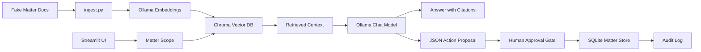

# Mini LOIS: CaseOps AI

Mini LOIS is a small local prototype of an agentic legal operations assistant. It demonstrates the product concepts behind an AI assistant that can read matter files, answer with citations, propose workflow actions, write approved actions back to a mock matter system, and keep an audit trail.

This is a portfolio project, not legal software and not legal advice. It is not affiliated with Filevine.

## What it demonstrates

- Matter-scoped retrieval so the assistant only searches inside the selected matter.
- Local RAG using Ollama embeddings and Chroma.
- Source-cited answers based on fake matter documents.
- Structured action proposals for tasks, notes, and calendar events.
- Approval gate before any write-back.
- SQLite-backed mock matter record.
- Audit log of executed AI-assisted actions.

## Architecture



## Tech stack

- Python
- Streamlit
- Ollama
- ChromaDB
- SQLite

## Setup

Install Ollama first, then pull one chat model and one embedding model.

```bash
ollama pull llama3.2
ollama pull nomic-embed-text
```

Create and activate a virtual environment.

```bash
python -m venv .venv
source .venv/bin/activate
pip install -r requirements.txt
```

On Windows PowerShell:

```powershell
python -m venv .venv
.\.venv\Scripts\Activate.ps1
pip install -r requirements.txt
```

Ingest the fake matter documents into Chroma.

```bash
python ingest.py
```

Run the app.

```bash
streamlit run app.py
```

## Suggested demo script

1. Select `MAT-1001 · Johnson v. RideshareCo`.
2. Ask: `What are the key risks and next steps in this matter?`
3. Confirm the answer cites retrieved sources.
4. Go to `Propose Action`.
5. Ask: `Create a task for the paralegal based on the most important missing item.`
6. Review the JSON action proposal.
7. Approve execution.
8. Check `Matter Record` and `Audit Log`.

## Product notes

The important design choice is the approval gate. The assistant can propose actions, but it cannot silently mutate matter data. This mirrors the product problem in legal AI: reliability, source grounding, permissions, and auditability matter as much as the generated text.

Potential next features:

- User roles and permission filters.
- Better action schema validation with Pydantic.
- Workflow triggers such as `new_document_uploaded` or `matter_phase_changed`.
- Simulated webhook payloads.
- Regression tests for retrieval quality.
- MCP server wrapper around the local matter tools.
