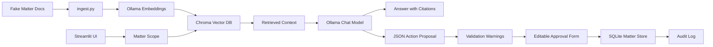

# Mini LOIS: CaseOps AI

Mini LOIS is a small local prototype of an agentic legal operations assistant. It demonstrates the product concepts behind an AI assistant that can read matter files, answer with citations, propose workflow actions, let a user edit/approve those actions, write approved actions back to a mock matter system, and keep an audit trail.

This is a portfolio project, not legal software and not legal advice. It is not affiliated with Filevine.

## Current version

v0.2 adds editable action approval, validation warnings, cleaner matter metadata display, and audit records that can store both the original model proposal and the final approved action.

## What it demonstrates

- Matter-scoped retrieval so the assistant only searches inside the selected matter.
- Local RAG using Ollama embeddings and Chroma.
- Source-cited answers based on fake matter documents.
- Structured action proposals for tasks, notes, and calendar events.
- Editable action approval before write-back.
- Validation warnings for risky operational fields such as unsupported due dates or non-matter assignees.
- SQLite-backed mock matter record.
- Audit log of executed AI-assisted actions, including human-edited approvals.

## Architecture



## Tech stack

- Python
- Streamlit
- Ollama
- ChromaDB
- SQLite

## Setup

Install Ollama first, then pull one chat model and one embedding model.

```bash
ollama pull llama3.2
ollama pull nomic-embed-text
```

Create and activate a virtual environment.

```bash
python3 -m venv .venv
source .venv/bin/activate
pip install -r requirements.txt
```

On Windows PowerShell:

```powershell
python -m venv .venv
.\.venv\Scripts\Activate.ps1
pip install -r requirements.txt
```

Ingest the fake matter documents into Chroma.

```bash
python3 ingest.py
```

Run the app.

```bash
streamlit run app.py
```

## Suggested demo script

1. Select `MAT-1001 · Johnson v. RideshareCo`.
2. Ask: `What are the key risks and next steps in this matter?`
3. Confirm the answer cites retrieved sources.
4. Go to `Propose Action`.
5. Ask: `Create a task for Miguel Santos to request only the missing PT records after April 19 and the urgent care billing ledger. Do not set a due date unless the matter file gives a task deadline.`
6. Review the model proposal and validation warnings.
7. Edit the title, due date, assignee, or reason if needed.
8. Approve the edited action.
9. Check `Matter Record` and `Audit Log`.

## Product notes

The important design choice is the approval workflow. The assistant can propose actions, but it cannot silently mutate matter data. v0.2 improves this by letting the user edit the proposed fields before execution. This mirrors the product problem in legal AI: generated actions need user control, source grounding, validation, and auditability.

Potential next features:

- Stronger validation with Pydantic schemas.
- Field-level source citations for action proposals.
- User roles and permission filters.
- Workflow triggers such as `new_document_uploaded` or `matter_phase_changed`.
- Simulated webhook payloads.
- Regression tests for retrieval quality.
- MCP server wrapper around the local matter tools.
