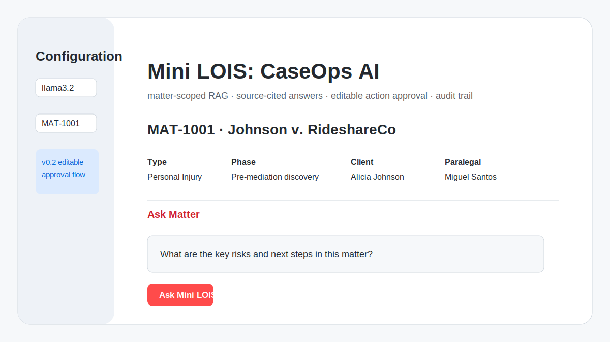
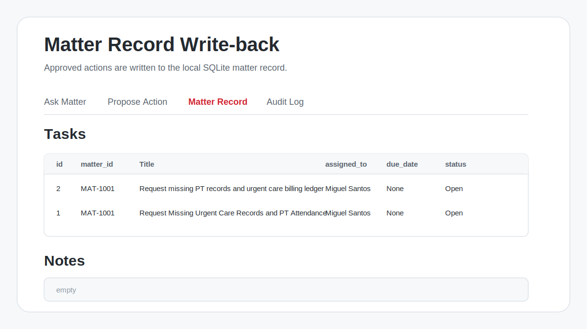
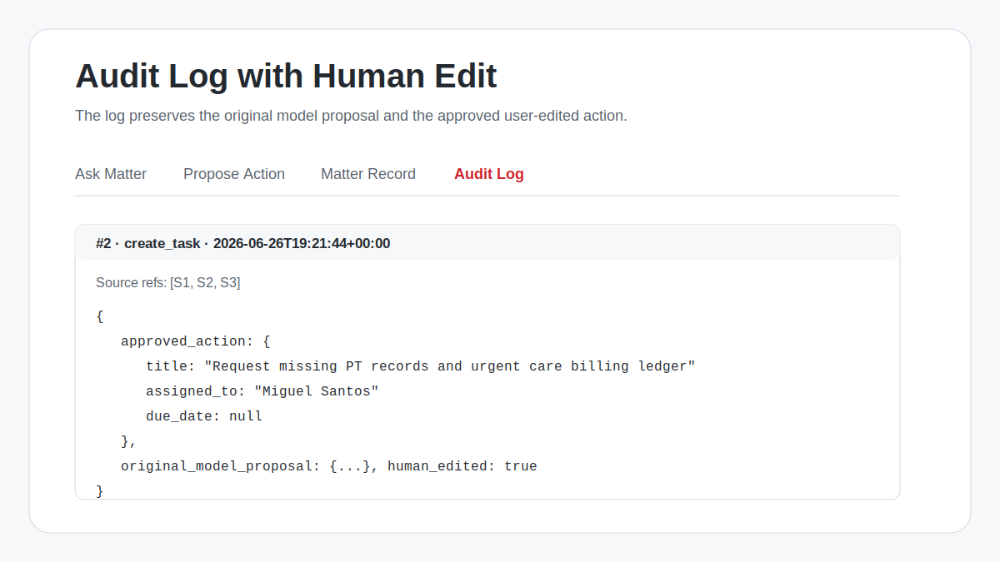

# Screenshots

These screenshots document the Mini LOIS demo flow.

## Matter summary with no actionable recommendations

This cropped screenshot shows Mini LOIS summarizing a matter in plain language while the action panel correctly detects that the answer does not contain discrete task recommendations.

## v0.2 home / matter-scoped RAG

## Matter record write-back

## Audit log with human edit

## Demo story

The demo flow demonstrates the product control loop:

1. Select a scoped matter.
2. Ask a source-grounded question.
3. Extract task candidates only when the answer contains discrete recommendations.
4. Generate an action proposal or task batch.
5. Edit the operational fields before approval.
6. Write the approved action to the matter record.
7. Preserve both the original model proposal and final approved action in the audit log.
